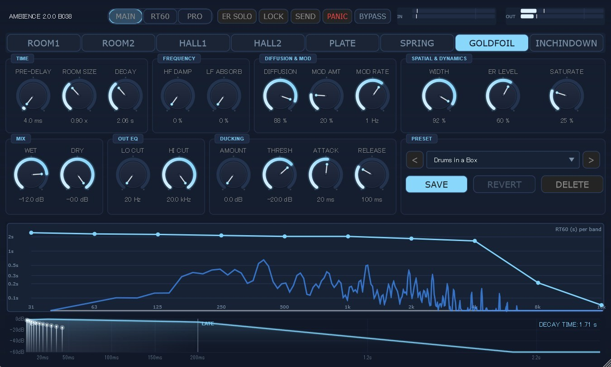
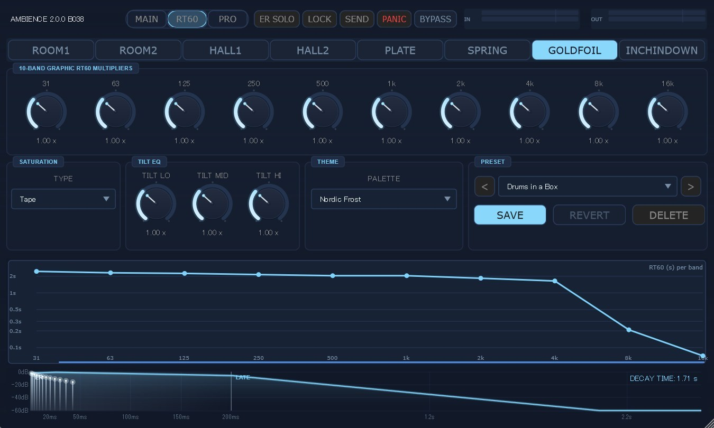
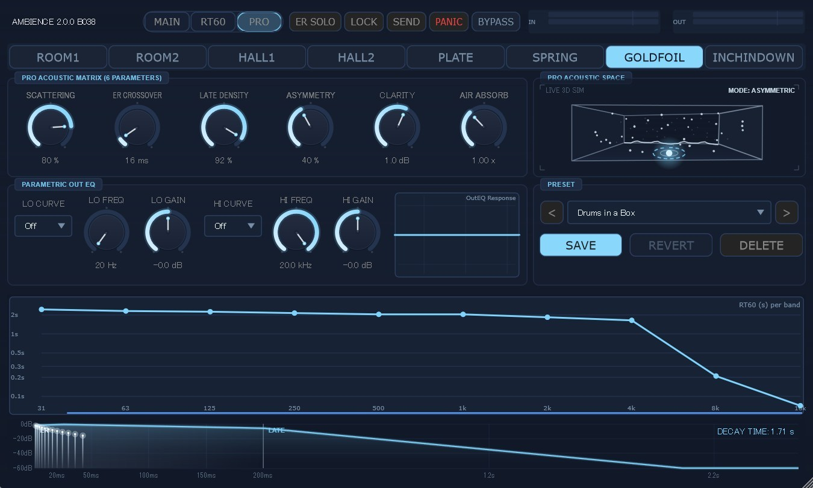
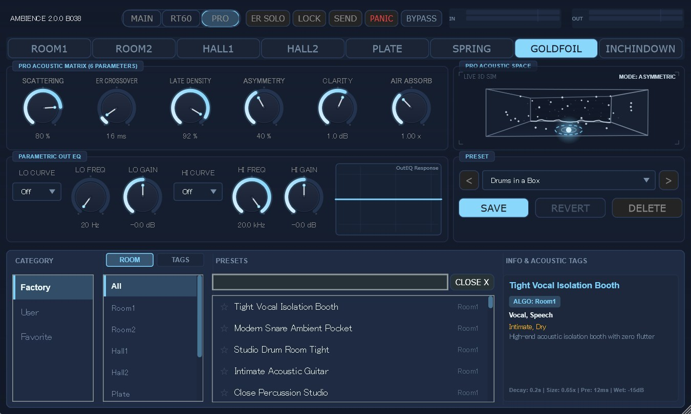

# Ambience


<p align="center">
  
  <br>
  <em>Ambience 2.0.0 — Main Interface featuring 16-channel FDN & SDN hybrid architecture, elegant glassmorphic controls, and dynamic two-tone vector styling.</em>
</p>

## Demo Videos

<p align="center">
  <b>Introduction YouTube Link</b><br>
  <a href="https://youtu.be/kytVu2M-t30">
    
  </a>
</p>

## Changelog

### v2.0.0 Major Update!!

**Hybrid Acoustic Engine & Algorithm Tuning:**
- **SDN × FDN Hybrid Architecture**: Integrated Spatial Decomposition Networks (SDN) early reflection modeling with the 16-channel Feedback Delay Network (FDN) core for seamless transition from direct sound to late reverberation.
- **8 Calibrated Reverb Topologies**: Comprehensive tuning of all 8 room algorithms (`ROOM1`, `ROOM2`, `HALL1`, `HALL2`, `PLATE`, `SPRING`, `GOLDFOIL`, `INCHINDOWN`) with distinct Allpass gains, scattering matrices, and algorithm-specific early reflection patterns (ISM, 2D Mesh, Spring1D, and Subterranean Inchindown).
- **Extreme Decay Auto-Scaling (up to 200s)**: Logarithmic RT60 auto-scaling series (`0.05s` to `200s`) with intelligent label decimation, perfectly accommodating Inchindown's world-record 112s decay without label overlapping.

**New PRO Acoustic Controls & Vector Visualizer:**
- **6 PRO Acoustic Physical Controls**: Added `SCATTERING`, `ER CROSSOVER` (10–100ms), `LATE DENSITY`, `ASYMMETRY`, `CLARITY` (-6 to +6dB), and `AIR ABSORB` (0.2–2.5x) for deep acoustic physics tailoring.
- **Pro Acoustic Space Visualizer (`ProAcousticSpaceViz`)**: Pure JUCE 8 vector-rendered 2.5D perspective visualizer illustrating room asymmetry morphing, scattering boundary textures, acoustic pulse wavefront rings, particle late density, core source clarity bloom, and atmospheric fog absorption.

**Next-Generation Preset Browser & 104 Factory Presets:**
- **104 Master-Calibrated Factory Presets**: Expanded library to 13 curated presets per algorithm (80% production-ready musical spaces, 20% creative sound-design presets) with individual dry/wet, ducking, OutEQ, and PRO acoustic knob settings.
- **Hybrid `[ ROOM ]` / `[ TAGS ]` Filtering**: Instant switching between traditional room topology browsing and multi-category acoustic tags (`Vocal & Speech`, `Drums & Snare`, `Acoustic & Guitar`, `Piano & Keys`, `Strings & Orch`, `Brass & Horns`, `Bass & LowEnd`, `Ambient & Pad`, `Creative & FX`).
- **Interactive INFO & Acoustic Tags Panel**: Real-time display showing preset title, algorithm badge, instrument tags, character vibe, detailed acoustic description, and quick parameter summaries.
- **Context-Aware `◀ ▶` Navigation**: Toolbar Previous / Next buttons dynamically cycle within the currently filtered tag or room type list.

**DSP Hardening & Sound Quality Refinements:**
- **Hermite / Farrow Fractional Delay Interpolation**: FDN delay lines upgraded to fractional interpolation with 1-pole target smoothing, completely eliminating clicks and zipper artifacts during realtime automation.
- **Dual-State Biquad Absorption Crossfading**: Dual-state ping-pong crossfading across all 160 absorption biquads, preventing transient energy bumps during decay and damping parameter changes.
- **Graceful ER Bypass**: Smooth 20ms gain fade-out replaces hard switches when ER Level is zeroed, eradicating discontinuity clicks.
- **Bit-Exact Mono Output**: Guaranteed $L = R$ bit-identical stereo collapse when `StereoWidth = 0%`.
- **Comb-Filter Offset Guard**: Intelligent +5ms delay floor protection during ER Solo and Send modes to prevent comb filtering with direct signals.
- **Ornstein-Uhlenbeck Modulation**: Independent seed Weil hash and mean-reverting OU random walk modulation for extreme stereo decorrelation (IACC ≤ 0.10).

**GUI & Theme Aesthetics:**
- **Enhanced Two-Tone Color Contrast**: Refined `Solar Flare` (solar gold × crimson flare), `Dark Amber` (amber gold × electric turquoise), and `Blood Moon` (blood red × moonlight ice blue) for superior contrast and visual clarity.
- **Theme-Reactive Modern Scrollbars**: Custom 6px pill-shaped vector scrollbars that automatically adapt their color and glow to the active theme across all browser lists.

---

### 1.3.0 Update!!
- Further sound quality improvements (noise reduction, silkier reverb tail)
- Enhanced stability and crash prevention

### v1.2.1 Update!!

**Dramatic Sound Quality Improvements:**
- **Zero-Metallic Diffusion (Dual Golden-Ratio LFOs & 3-Stage SAPF)**: Fully integrated 16-channel asynchronous Dual Golden-Ratio LFOs with 3-stage serial Allpass phase smearing, completely eliminating metallic ringing, flutter echoes, and standing waves on high-register chords (e.g. B5–E6) and sharp percussive transients for a silky, ultra-transparent reverb tail.
- **Asymmetric Micro-Saturation & Harmonic Warmth**: Embedded soft-knee asymmetric micro-saturation (precise even/odd harmonic blending) within the 16-channel FDN feedback loop, suppressing cold digital limit cycles and delivering analog-grade depth, lushness, and air absorption.
- **Colossal Subterranean Resonance ("Inchindown")**: Added the world-record holding Inchindown Oil Tanks algorithm with decay times up to 112 seconds, featuring immense low-frequency resonance (31 Hz–125 Hz) and vast spatial envelopment.
- **Seamless ISM Early Reflection Coupling**: Coupled algorithm-specific 12-tap Image Source Method (ISM) early reflections with frequency-dependent boundary absorption filters, achieving natural spatial depth without phase cancellation.
- **22 Acoustically Calibrated Factory Presets**: Completely re-engineered all factory presets (including iconic concert halls, tracking rooms, and vintage chambers) with optimized multi-band RT60 profiles and unified Dry 0 dB / Wet -12 dB gain staging.

**New Features & Architecture:**
- **10 Dynamic Color Themes (THEME Selector)**: Added a THEME selector in Pro Mode featuring 10 distinct two-tone contrast themes (`Cyber Neon` [default], `Solar Flare`, `Matrix Glow`, `Vaporwave`, `Dark Amber`, `Nordic Frost`, `Deep Purple`, `Midnight`, `Blood Moon`, `Monochrome`) with real-time vector UI updates.
- **Smart Preset Management & REVERT Function**: Added real-time preset edit tracking (`*` indicator) and a dedicated 1-click **`REVERT` button** to instantly restore original preset settings. Redesigned toolbar with a wide preset combo and bottom 4-button group (`SAVE`, `REVERT`, `LOAD`, `DELETE`).
- **Control Enhancements**: Added **`SEND`** mode button (Dry -60 dB / Wet 0 dB for aux bus), **`PANIC`** emergency mute button, and **`LOCK`** parameter freeze button.
- **Scalable GUI**: Smooth vector GUI resizing from 80% to 150% with fixed aspect ratio.
- **Real-Time Decay Time Readout**: High-visibility single-line readout (`DECAY TIME: XX.X s`) updated dynamically with knob movements.
- **DSP Performance Optimization**: Algebraic ducking optimization, integer delay bypass (`readInt`), invariant loop caching, and inactive GUI FFT idling for maximum CPU efficiency.

### v1.2.0 "No Compromise" Update

**New Features:**
- **Real-time Spectrum Analyzer**: Added a Lock-free real-time frequency spectrum overlay (showing both Dry and Wet signals in gray and blue) mapped logarithmically to match the RT60 Visualizer.
- **Expanded Diffusion limits**: Increased the maximum diffusion limits to achieve denser late reverberation without triggering self-oscillation.

**Ultimate DSP Optimizations (No Compromise):**
- **Hermite 3rd-Order Interpolation**: Upgraded the core `LinearDelayLine` from linear to FIR-based Hermite 3rd-order interpolation, completely eliminating high-frequency loss in the FDN loop and restoring silky, transparent reverb tails.
- **True Stereo Pre-Delay**: Split the Pre-Delay routing into independent L/R lines *before* the Mid/Side matrix. This ensures wide stereo sources perfectly retain their stereo image when hitting the reverb, fixing a previous mono-collapse compromise.
- **Audio-Rate Parameter Smoothing**: Implemented a 64-sample throttling engine for `updateTopologyAndRouting()`. Fast automation of Decay/EQ no longer causes zipper noise or filter instability across the 160 Biquads.
- **High-Precision Chorus LFO**: Replaced the parabolic sine approximation with a massive 1024-point Sine LUT and linear interpolation, driving the LFO THD below -96dB for perfectly smooth modulation without metallic artifacts.
- **64-bit Double Precision Filters**: Ensured the 10-band GEQ `BiquadState` runs in `double` (64-bit float) precision using Direct Form II Transposed, completely preventing quantization noise accumulation in long decay tails.

**Bug Fixes:**
- **Metallic ringing (C#6/D6) elimination**: Eliminated harsh standing waves and metallic resonances in high-frequency sine inputs by introducing Valhalla-style deep asymmetrical phase smearing and optimizing APF gains.
- **Early Reflections (ER) logic fix**: Fixed ERSolo incorrectly passing the Dry signal, and enabled proper 12-tap ER patterns for Plate, Spring, and Goldfoil algorithms.
- **Algorithm switching noise fix**: Mitigated harsh audio glitches and memory corruption artifacts when changing RoomSize or switching Algorithms by instantly zero-clearing the delay buffers.

### v1.1.0

**Bug Fixes:**
- **PreDelay fix**: Fixed PreDelay parameter not being applied to DSP. Now correctly feeds both ER and FDN paths.
- **Metallic comb-filter artifact fix**: Addressed metallic ringing at long DecayTime values with four countermeasures: DC blocker in FDN loop, decay-dependent micro-saturation blend, modulation depth scaling, and dynamic nested allpass modulation.
- **Preset PRO Mode fix**: Fixed PRO Mode state being incorrectly restored on preset load. Now always resets to Normal mode.

**Sound Quality Improvements:**
- **Chorus-style pitch modulation**: Added sine-wave LFO (ChorusLFO) per FDN channel with golden-ratio phase/rate distribution, layered on top of the existing noise LFO for richer, more organic tail texture.
- **3-stage serial allpass chain**: Expanded nested allpass from 1 stage to 3 serial stages per FDN channel with varied delay times and modulation depths, greatly increasing late-field echo density.
- **ER to late reverb transition smoothing**: Early reflection output is now fed into the FDN input at 15% blend, simulating the natural transition from early reflections to late reverberation.
- **Frequency-dependent modulation**: Modulation depth now scales per FDN channel (1.5x for short-delay/HF channels, 0.5x for long-delay/LF channels), matching the physical behavior of air turbulence.
- **Soft-knee RMS compression in FDN loop**: Added per-channel RMS envelope follower with soft-knee compression (threshold 0.35), providing transparent level control without harmonic distortion.
- **Thiran allpass fractional delay interpolation**: Replaced linear interpolation with 1st-order Thiran allpass for FDN main delay lines, achieving flat magnitude response (|H(ω)|=1) and preserving high-frequency clarity in the feedback loop.

**CPU Optimizations:**
- Replaced `std::sin()` in chorus LFO with parabolic sine approximation (5–10x faster, <0.1% error).
- Moved `std::sqrt()` in soft-knee compression inside threshold branch (only computed when compression is active).
- Precomputed all loop-invariant values: frequency-dependent modulation scales, input diffuser delays, allpass base delays (16ch × 3 stages), ER tap gains, and allpass gain stage.
- Cached sample rate as float to eliminate repeated double to float casts in the hot path.

## Overview

**Ambience** is a high-quality, open-source algorithmic reverb VST3 plugin built on a **16-channel Feedback Delay Network (FDN)** and **Spatial Decomposition Network (SDN)** hybrid architecture. Designed with professional audio engineering standards in mind, it delivers rich, natural-sounding reverberation ranging from intimate studio booths to monumental scoring stages and infinite subterranean tanks — with the mathematical precision and real-time stability demanded by high-end music production.

Ambience ships with **104 acoustically calibrated factory presets** spanning 8 distinct reverb algorithms. Whether you need a tight drum room, a warm vocal plate, a classic spring coil, an opulent symphonic hall, or an expansive ambient drone space, Ambience delivers pristine clarity, lush envelopment, and zero metallic ringing.

👉 **[Watch the Demo Video (動作デモ動画はこちら)](https://x.com/kijyoumusic/status/2055967062325944741?s=20)**

## Key Features

### 🎛️ 16-Channel FDN & SDN Hybrid Engine

A research-grade Feedback Delay Network forms the acoustic core of Ambience:

* **16-channel FWHT Feedback Matrix:** Fast Walsh-Hadamard Transform ensures dense, colorless diffusion with optimal mode distribution.
* **Nearest-Prime Delay Allocation:** Delay lines are tuned to unique prime numbers distributed on a logarithmic scale, guaranteeing mutual coprimality across all 16 channels and eliminating comb-filter artifacts at any room size.
* **8 Reverb Algorithms:** ROOM1, ROOM2, HALL1, HALL2, PLATE, SPRING, GOLDFOIL, INCHINDOWN — each with distinct topological routing, allpass gains, boundary scattering, and early reflection patterns.

### 🧪 Professional DSP Modules

* **Stage 2 GEQ Absorption (Välimäki-Liski):** A 10-band biquad Graphic EQ cascade per FDN channel, solving a Weighted Least Squares system to achieve accurate, frequency-dependent RT60 targets across the audible spectrum.
* **ISM & Mesh Early Reflections:** Image Source Method and physical mesh patterns tuned per algorithm, providing perceptually accurate pre-echo with full stereo imaging control.
* **Ornstein-Uhlenbeck Modulation:** Each of the 16 FDN channels is modulated by independent-seed, mean-reverting stochastic processes to guarantee non-periodic, chorus-free spatial decorrelation.
* **ADAA Saturator (4 Modes):** Anti-Derivative Anti-Aliasing saturation applied to the wet path: **Warm** (Vicanek), **Tape** (Padé rational), **Tube** (asymmetric even harmonics), **Hard** (hard clip + ADAA).
* **Micro-Saturation (FDN Loop):** Internal saturator in the feedback loop acts as a safety limiter, suppressing limit cycles without audible coloration.
* **Output EQ:** Linkwitz-Riley 12 dB/oct Lo Cut (20–1000 Hz) and Hi Cut (1 kHz–20 kHz) applied to the wet path with Shelf/Cut curve selection.
* **Brick-Wall Output Limiter:** -0.5 dBFS brick-wall limiter as the final safety stage.
* **Dynamic Ducking:** Envelope follower with independent Threshold, Amount, Attack, and Release controls.

### 📊 Real-Time Visualizers

<p align="center">
  
  <br>
  <em>Multi-Band RT60 Visualizer & Real-time Spectrum Analyzer featuring dynamic logarithmic auto-scaling (0.05s to 200s), ER/Late split decay curves, and live acoustic metrics.</em>
</p>

* **RT60 Graph:** Displays 10-band RT60 curves (31 Hz – 16 kHz) in logarithmic scale. The orange curve shows the actual effective RT60 (including HF Damping and LF Absorption), while the gray curve shows the preset baseline. The Y-axis automatically scales from 0.05s up to 200s with intelligent label decimation.
* **Decay Curve Visualizer:** Split time-axis display showing Early Reflections (0–100 ms, expanded 2×) and Late Reverb decay curve side-by-side with color-coded ER tap markers and envelope fill.
* **Real-time Spectrum Overlay:** Lock-free frequency distribution overlay showing both dry and wet signals in real time.
* **Acoustic Metrics:** Live readout of D50 (%), C50 (dB), C80 (dB), and EDT (s) derived from acoustic analysis.

### 🔬 Pro Mode & Pro Acoustic Controls

<p align="center">
  
  <br>
  <em>Pro Mode Panel featuring the 6 PRO ACOUSTIC physical knobs, real-time 2.5D Pro Acoustic Space Visualizer, 10-band octave RT60 multipliers, and OutEQ curve visualizer.</em>
</p>

Unlock deep per-band and physical acoustic control:

* **6 PRO ACOUSTIC Physical Controls:**
  - **SCATTERING (0–100%):** Boundary surface acoustic scattering coefficient (specular reflection to QRD diffusion panels).
  - **ER CROSSOVER (10–100ms):** Temporal boundary transition between discrete early reflections and late reverberation.
  - **LATE DENSITY (0–100%):** Rate of late echo buildup and modal density growth.
  - **ASYMMETRY (0–100%):** Room non-parallelism and geometric skew, breaking axial standing waves.
  - **CLARITY (-6 to +6dB):** Direct sound clarity (C80/C50) contrast ratio.
  - **AIR ABSORB (0.2–2.5x):** High-frequency atmospheric molecular absorption scaling.
* **Pro Acoustic Space Visualizer:** Real-time 2.5D perspective vector display dynamically illustrating room deformation, scattering textures, wavefront rings, particle density, sound clarity glow, and atmospheric depth fog.
* **10-Band RT60 Multipliers:** Fine-tune octave band RT60 multipliers independently (31 Hz – 16 kHz).
* **Tilt EQ × 3:** Broad spectral tilt controls for Low, Mid, and High frequency regions.
* **OutEQ Curve Visualizer:** Real-time visual curve of high-pass and low-pass output filtering.

### 📚 Preset Management & Browser

<p align="center">
  
  <br>
  <em>3-Column Overlay Preset Browser with 104 curated factory presets, hybrid [ROOM] / [TAGS] filtering, instant search, favorite tagging, and acoustic information panel.</em>
</p>

* **3-Column Modern Overlay Browser:** Click the preset display to open a full-height overlay browser without obstructing essential workflow controls.
* **Hybrid `[ ROOM ]` / `[ TAGS ]` Browsing:** Switch seamlessly between room topology categorization and musical instrument tags (`Vocal & Speech`, `Drums & Snare`, `Acoustic & Guitar`, `Piano & Keys`, `Strings & Orch`, `Brass & Horns`, `Bass & LowEnd`, `Ambient & Pad`, `Creative & FX`).
* **INFO & Acoustic Tags Panel:** Right-hand card displaying preset title, algorithm badge, instrument tags, character description, and quick acoustic parameter readouts.
* **Context-Aware `◀ ▶` Cycling:** Top navigation buttons cycle strictly within the active tag, room type, or search filter.
* **Favorite Tagging (★):** Single-click favorite tagging with instant persistence to disk.
* **Instant Full-Text Search:** Real-time search across preset names, tags, and acoustic descriptions.
* **Revert & Save Functions:** 1-click `REVERT` button to undo edits, alongside `SAVE` and `DELETE` for custom user presets.

### ⚡ Real-Time Safety & DAW Compatibility

Built to the strictest real-time audio standards, with specific hardening for Ableton Live and major DAWs:

* **Zero Heap Allocation on Audio Thread:** All buffers pre-allocated in `prepareToPlay()`. No `new` / `malloc` / `std::vector::resize()` calls in `processBlock()`.
* **Lock-Free Parameter Dispatch:** Dirty-flag parameter updates prevent redundant Stage 2 GEQ matrix inversions during steady states.
* **Fractional Delay Smoothing:** 1-pole smoothed delay line reading prevents clicks or zipper noise during parameter automation.
* **Dual-State Filter Crossfading:** Equal-power crossfading eliminates transient energy bumps when changing decay times or absorption filters.
* **Graceful ER Bypass:** 20ms gain smoothing prevents audio dropouts or pops when bypassing early reflections.
* **ScopedNoDenormals:** Applied at the entry of every `processBlock()` call to suppress denormal CPU spikes.
* **Safe Component Destruction:** `stopTimer()` and `setLookAndFeel(nullptr)` called explicitly to prevent host shutdown crashes.

## Preset Guide

### 104 Curated Factory Presets

Ambience ships with 104 factory presets spanning 8 algorithms (13 presets each: ~80% musical, ~20% creative):

| Algorithm | Count | Sound Character & Typical Applications | Example Presets |
|---|---|---|---|
| **ROOM1** | 13 | Tight acoustic studio, vocal isolation booth, drum tracking room | *Tight Vocal Isolation Booth*, *Modern Snare Ambient Pocket*, *Intimate Acoustic Guitar* |
| **ROOM2** | 13 | Medium live recording room, natural oak floor, warm grand piano | *Natural Oak Drum Room*, *Vintage Maple Live Studio*, *Vocal Wood Chamber Lush* |
| **HALL1** | 13 | Medium concert hall, recital stage, film scoring stage | *Viennese String Hall*, *Steinway Recital Stage*, *Hollywood Scoring Stage* |
| **HALL2** | 13 | Large symphony hall, gothic stone cathedral, arena rock | *Concert Symphony Hall*, *Monumental Stone Cathedral*, *Lush Ballad Vocal* |
| **PLATE** | 13 | Classic EMT 140 steel plate, warm tube preamp, fast dense build | *EMT 140 Vintage Vocal*, *Tight Snare Plate*, *Silky Pop Vocal*, *60s Motown Plate* |
| **SPRING** | 13 | Dual-spring amp tank, AKG BX20 studio spring, Kingston dub splash | *63 Surf Twin Drip*, *Studio Golden BX20*, *Kingston Dub Splash*, *Suitcase Rhodes Spring* |
| **GOLDFOIL** | 13 | EMT 240 gold-foil micro-plate, luxurious top-end sheen, delicate decay | *01 Gold Modern Lead Vocal*, *03 Silk String Ensemble Air*, *04 Grand Piano Golden Aura* |
| **INCHINDOWN**| 13 | Guinness World Record 112s subterranean oil tank, infinite drone space | *Guinness Subterranean 112s*, *Cinematic Drone Horizon*, *Dark Post-Rock Cavern* |

### Preset File Location

User presets are saved as `.ambpreset` files (standard binary XML format):

```
Windows: C:\Users\<YourName>\Documents\Ambience\Presets\
```

### Sharing Presets

1. Navigate to `Documents\Ambience\Presets\`
2. Copy the desired `.ambpreset` file(s)
3. Share with any Ambience 2.0.0 user — presets load instantly via the User category.

## Parameter Reference

### Main Knobs

| Parameter | Range | Default | Description |
|---|---|---|---|
| PRE-DELAY | 0 – 500 ms | 10 ms | Pre-delay before early reflection & reverb onset |
| ROOM SIZE | 0.3 – 2.0 | 1.0 | Scales FDN delay line lengths (apparent physical volume) |
| DECAY | 0.1 – 120.0 s | 1.5 s | Mid-band reverberation time RT60 |
| HF DAMP | 0.0 – 1.0 | 0.0 | High-frequency damping ratio (air molecular & surface absorption) |
| LF ABSORB | 0.0 – 1.0 | 0.0 | Low-frequency boundary absorption ratio |
| DIFFUSION | 0.0 – 1.0 | 0.7 | Input diffuser and nested allpass scattering coefficient |
| MOD AMT | 0.0 – 1.0 | 0.25 | Stochastic Ornstein-Uhlenbeck modulation depth |
| MOD RATE | 0.05 – 2.0 Hz | 0.5 Hz | Modulation cycle rate |
| WIDTH | 0.0 – 1.0 | 0.8 | Stereo field width (0.0 = bit-exact mono, 1.0 = wide stereo) |
| ER LEVEL | 0.0 – 1.0 | 0.6 | Early reflections level with graceful bypass |
| SATURATE | 0.0 – 1.0 | 0.0 | Wet-path ADAA saturation amount |
| SAT TYPE | Warm/Tape/Tube/Hard | Warm | Saturation nonlinear curve character |
| DRY | -60 – 0 dB | 0 dB | Dry signal level |
| WET | -60 – 0 dB | -12 dB | Wet reverberation signal level |
| DUCKING AMOUNT | 0 – 20 dB | 0 dB | Sidechain ducking reduction amount |
| DUCKING THRESH | -60 – 0 dB | -20 dB | Sidechain ducking threshold |
| DUCKING ATTACK | 0.5 – 100 ms | 10 ms | Ducking envelope attack time |
| DUCKING RELEASE | 10 – 2000 ms | 200 ms | Ducking envelope release time |

### PRO Acoustic Controls

| Parameter | Range | Default | Description |
|---|---|---|---|
| SCATTERING | 0.0 – 1.0 | 0.5 | Wall boundary diffusion vs. specular reflection |
| ER CROSSOVER | 10 – 100 ms | 40 ms | Transition boundary time between ER and late reverberation |
| LATE DENSITY | 0.0 – 1.0 | 0.7 | Late echo modal density buildup speed |
| ASYMMETRY | 0.0 – 1.0 | 0.3 | Geometric room non-parallelism and skew factor |
| CLARITY | -6.0 – +6.0 dB | 0.0 dB | Direct sound clarity (C80/C50) contrast balance |
| AIR ABSORB | 0.2 – 2.5 x | 1.0 x | Atmospheric high-frequency absorption scale multiplier |

### Pro Mode Multipliers & Output EQ

| Parameter | Range | Default | Description |
|---|---|---|---|
| RT 31Hz – 16kHz | 0.5 – 2.0× | 1.0× | Octave-band RT60 multiplier (10 independent bands) |
| TILT LOW/MID/HIGH | 0.5 – 2.0× | 1.0× | Macro spectral RT60 multipliers for Low, Mid, and High regions |
| LO FREQ / GAIN | 20–1000 Hz / ±12 dB | 20 Hz / 0 dB | Low cut / shelf filter on wet output |
| HI FREQ / GAIN | 1k–20k Hz / ±12 dB | 20 kHz / 0 dB | High cut / shelf filter on wet output |

## Installation

1. Download the latest `Ambience2.0.0.vst3` from the [Releases](https://github.com/OTODESK4193/Ambience/releases/latest) page.
2. Place the `.vst3` file into your system VST3 directory:
   ```
   C:\Program Files\Common Files\VST3\
   ```
3. Rescan plugins in Ableton Live or your preferred DAW.

## 📖 User Guide

Comprehensive documentation covering detailed acoustic theory and operational guidelines is included in the repository:

[ -red?style=for-the-badge&logo=adobe-acrobat-reader) ](Source/Assets/Ambience_UserManual_JP.pdf)
[ -red?style=for-the-badge&logo=adobe-acrobat-reader) ](Source/Assets/Ambience_UserManual_EN.pdf)

## System Requirements

* **OS:** Windows 10 / Windows 11 (64-bit)
* **Format:** VST3 (64-bit) / Standalone
* **CPU:** AVX2 SIMD support required
* **Tested Hosts:** Ableton Live 11 / 12, FL Studio, Studio One, Reaper, Cubase

## Technical Architecture

```
Input (Stereo L/R)
    │
    ├─► [Mid/Side Decorrelation Matrix]
    │
    ├─► [Input Diffusers × 4 stages]
    │
    ├─► [SDN / ISM Early Reflections Engine] ────────────────────────┐
    │                                                                │
    └─► [16-Channel FDN Core]                                        │
         ├─► FWHT Unitary Feedback Matrix                            │
         ├─► Ornstein-Uhlenbeck Stochastic LFOs                      │
         ├─► Dual-State 10-Band Biquad Absorption Filters (GEQ)      │
         ├─► Internal Padé Micro-Saturation Safety Loop              │
         └─► 3-Stage Nested Allpass Dispersion Chains                │
                    │                                                │
                    └─► [ER Mix + Late FDN Mix] ◄────────────────────┘
                                │
                         [ADAA Saturator: Warm/Tape/Tube/Hard]
                                │
                         [Output EQ: Lo/Hi Cut & Shelf]
                                │
                         [Brick-Wall Output Limiter]
                                │
                         Wet Output × SmoothedGain
                                │
                    [Dry Signal × SmoothedGain] ─────────────────────┐
                                                                     ▼
                                                             Final Stereo Output
```

## Acoustic Metrics Reference

| Metric | Description | Target Range |
|---|---|---|
| **D50** | Definition — ratio of early energy (0–50ms) to total energy | >0.5 for vocal clarity |
| **C50** | Clarity (speech) — early-to-late energy ratio at 50ms | >0 dB for speech |
| **C80** | Clarity (music) — early-to-late energy ratio at 80ms | -2 to +4 dB for music |
| **EDT** | Early Decay Time — initial RT60 estimated from first 10 dB decay | ≈ Mid-band RT60 |

## Disclaimer

This software is provided "as-is", without warranty of any kind. While rigorous testing (1,200 automated acoustic validation cases) has been conducted to ensure real-time safety, unexpected behavior may still occur on unsupported host configurations.

## License

This project is licensed under the GNU Affero General Public License v3.0 (AGPLv3) - see the [LICENSE](LICENSE) file for details. Built using the **JUCE 8** framework.

## Credits

**Developer:** @kijyoumusic (OTODESK)

**Music Production Background:** Electronic Music, Sound Design, DSP Engineering

**Target DAW:** Ableton Live 11 / 12

**Framework:** JUCE 8.0.x

**DSP References:**
- Välimäki & Liski — *"Accurate Cascade Graphic Equalizer"* (2017)
- Vicanek — *"Matched Second Order Digital Filters"* (2016)
- Schlecht & Habets — *"On Lossless Feedback Delay Networks"* (2017)
- Parker et al. — *"Modelling plate and spring reverberation using DSP-informed DNN"* (2019)

## Support

* **Social / Demo:** [@kijyoumusic](https://x.com/kijyoumusic)
* [](https://otodesk4193.github.io/OTODESK_SITE/)
